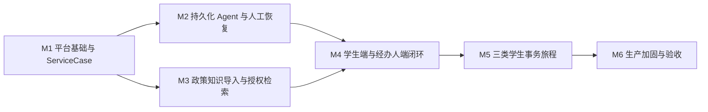

# 高校学生事务 Agent 平台交付路线图

- 日期：2026-07-16
- 状态：已规划，等待执行
- 上位规格：`docs/superpowers/specs/2026-07-16-student-affairs-platform-design.md`

## 1. 路线图目的

本路线图把完整平台拆成六个能够独立评审、测试和演示的纵向里程碑。每个里程碑必须交付真实可运行能力，不以空模块、静态页面或内存状态冒充完成。后续每个里程碑在开始前都需要一份独立的详细实施计划。

## 2. 统一交付规则

每个里程碑都遵守以下规则：

1. 先写失败测试，再实现最小可用行为。
2. 所有正式业务状态写入 PostgreSQL；缓存、Checkpoint、队列和前端状态不是业务事实来源。
3. LLM 输出必须经过结构校验、授权和确定性命令处理器，不能直接写业务表。
4. 所有外部副作用具备幂等键、超时、有限重试、审计和明确错误语义。
5. 本地 Compose 可以单节点运行，但接口、状态机、授权和恢复语义与生产设计一致。
6. 每个里程碑结束时运行单元、契约、集成和适用的系统测试，并更新 ADR、运行手册和威胁模型。
7. 每次提交前执行格式、类型、测试和敏感信息扫描；不提交真实学生数据和凭据。

## 3. 里程碑依赖图

## 4. M1：平台基础与 ServiceCase 纵向切片

### 目标

建立可安装、可测试、可观测的后端基础，并通过真实 OIDC 身份和 PostgreSQL 完成 `ServiceCase` 的创建、提交、按权限查询、事件审计和 Outbox 写入。

### 主要交付

- Python 3.11 Conda 环境、根 `pyproject.toml`、质量门和测试目录。
- 模块化后端包与 FastAPI App Factory。
- `IdentityContext`、`ServiceCase`、`CaseEvent`、`OutboxEvent` 和幂等记录。
- `DRAFT -> SUBMITTED` 状态转换、乐观锁和学生数据隔离。
- PostgreSQL Repository、Unit of Work 和 Alembic migration。
- Keycloak 本地 Realm、学生/经办人客户端和 JWT 校验。
- `/api/v1/cases` 创建、提交和查询接口。
- PostgreSQL 与 Keycloak Compose Profile。
- 首份 ADR、开发运行手册和最小威胁模型。

### 验收门

- 学生 A 不能读取学生 B 的事项，返回 `404`，避免泄露资源是否存在。
- 重复提交同一幂等键只产生一次状态变化、一次领域事件和一次 Outbox 事件。
- 错误 `expected_version` 返回 `409`，不会覆盖新状态。
- 服务重启后事项、事件和幂等结果仍存在。
- 无有效 OIDC Token 的业务接口返回 `401`。

### 详细计划

`docs/superpowers/plans/2026-07-16-foundation-service-case-plan.md`

## 5. M2：持久化 Agent 与人工中断恢复

### 目标

建立 Agent Harness、LangGraph PostgreSQL Checkpoint、RabbitMQ/Celery 执行器和正式 `WorkItem`，完成一个可中断、可重启、可恢复的困难补助申请骨架。

### 主要交付

- `IdentityContext`、`ModelPolicy`、`ToolPolicy`、`ContextBudget`、`ExecutionPolicy` 和 `TracePolicy`。
- `WorkflowRun`、`thread_id`、`run_id` 与 `case_id` 的稳定关联。
- LangGraph PostgreSQL Checkpointer 和仅含可序列化数据的 Graph State。
- RabbitMQ 队列、Celery Worker、事务 Outbox Relay、消费去重和死信策略。
- Case Intake 子图：信息收集、确定性预检、确认提交和人工审批中断。
- `WorkItem` 创建、领取、决定、Outbox 恢复和版本冲突处理。
- Worker 崩溃、重复消息、过期任务和恢复冲突测试。

### 验收门

- API 和 Worker 重启后能从已持久化 Checkpoint 与业务事实恢复。
- 人工决定先形成数据库事务，Graph 后恢复；旧 Checkpoint 不能覆盖最新事项版本。
- 同一恢复消息重复投递不会重复审批或重复写事件。
- 模型不可用时事项保持一致并创建人工接管任务。

## 6. M3：政策知识导入与授权检索

### 目标

建立政策来源登记、版本化导入、质量门、发布回滚和身份约束的 BGE-M3 混合检索，形成可引用的政策咨询能力。

### 主要交付

- `PolicySource`、`PolicyVersion`、`ImportBatch`、`Document`、`Section` 和 `Chunk` 元数据。
- MinIO 暂存、病毒扫描接口、MinerU/OCR Adapter、结构规范化和稳定 ID。
- BGE-M3 稠密/稀疏向量与 Milvus batch/version 隔离。
- `STAGED -> ACTIVE -> RETIRED` 发布状态、质量报告、审批和回滚。
- 授权过滤前置、有效期/来源/冲突后置校验。
- Dense + Sparse、RRF、本地 Reranker 的检索计划和评测基线。
- 政策引用快照，包含来源、页码、版本、生效时间和可见范围。

### 验收门

- 未发布、已失效或无权访问的政策不会出现在召回结果中。
- 导入失败不会使半成品数据对查询可见。
- 发布与回滚不依赖跨 PostgreSQL、Milvus、MinIO 的伪分布式事务。
- 每个答案引用都能定位到授权可见的政策版本和原始位置。

## 7. M4：学生端与经办人端业务闭环

### 目标

交付两个独立 Vue 应用、统一 API SDK、持久事件流和经办人待办操作，使学生咨询、事项进度和人工协同形成端到端闭环。

### 主要交付

- `apps/student-web`：咨询、我的事项、材料、通知和结果。
- `apps/staff-web`：待办队列、事项详情、材料、证据、时间线和决定表单。
- OIDC Authorization Code + PKCE，两端独立客户端和路由守卫。
- OpenAPI 生成的 TypeScript SDK，禁止手写漂移 DTO。
- 持久化 `BusinessEventProjection` 与 SSE `Last-Event-ID` 重连。
- 预签名上传、服务端下载授权和材料状态反馈。
- Agent 建议与正式人工决定分区展示。

### 验收门

- 浏览器刷新和 API 重启后，进度流可以从上一个事件继续。
- 学生端无法调用经办动作；经办人只能访问授权部门和事项范围。
- UI 不显示内部节点、Prompt、向量分数、堆栈或 Token 数据。
- 两端完成键盘操作、基础无障碍和主流桌面/移动视口测试。

## 8. M5：三类学生事务旅程

### 目标

通过版本化 `ServiceDefinition` 和专用子图交付临时困难补助、选课退改咨询与宿舍报修，不把场景规则写死到通用 Agent。

### 主要交付

- `ServiceDefinition` schema、版本发布、迁移约束和规则解释。
- 临时困难补助：信息补全、材料核验、资格预检、人工审批、补件、结果回访。
- 选课退改：政策问答、适用范围、时间窗口、材料和办理入口；默认不创建事项。
- 宿舍报修：结构化报修信息、风险分级、部门路由、处理结果和学生确认。
- 校务、资助、宿舍和通知 Port，以及与生产契约一致的本地 Mock Adapter。
- 规则、Prompt、模型和政策版本的可追溯关联。

### 验收门

- 三个旅程均通过成功、拒绝、补件、超时、取消和外部依赖失败路径。
- 高风险和例外决定始终进入授权人工待办。
- 新增事项类型主要通过定义和独立子图扩展，不修改通用状态机核心。

## 9. M6：生产加固、评测与交付验收

### 目标

完成安全、性能、可观测、备份恢复、AI 质量和运维交付，使系统具备真实高校试点部署条件。

### 主要交付

- OpenTelemetry Trace、指标、结构化日志与业务审计分离。
- SLO、错误率、队列积压、模型延迟/成本、外部依赖和安全告警。
- 数据分级、脱敏、密钥管理、TLS、恶意文件扫描和保留删除策略。
- AI 离线评测集：意图、路由、召回、精排、忠实度、引用、拒答和越权。
- 峰值 500 在线用户、约 100 并发工作流的容量验证。
- RPO 15 分钟、RTO 1 小时目标下的备份恢复演练。
- 依赖故障、重复消息、网络分区、模型超时和 Worker 崩溃的故障注入。
- 生产配置契约、发布清单、回滚手册和高校系统接入手册。

### 验收门

- 未授权跨学生、跨部门数据访问测试零通过。
- 高风险自主决定测试零通过。
- 关键 SLO、恢复目标和容量目标具备可重复测试证据。
- 候选发布可灰度、可回滚、可审计，并通过敏感信息扫描。

## 10. 计划维护方式

- 每个里程碑开始前创建独立详细计划，路径为 `docs/superpowers/plans/`。
- GitHub Issue 只承载可独立验收的任务，并链接对应计划章节。
- 任务完成时更新测试证据、ADR 和风险，不用“本地能跑”替代生产语义验收。
- 如果架构事实发生变化，先更新规格或 ADR，再更新路线图和下游计划。
