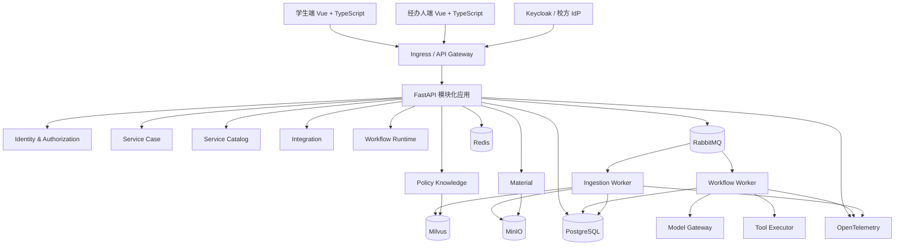

# 高校学生事务智能分诊与服务协同系统设计

- 日期：2026-07-16
- 状态：待最终书面审阅
- 项目：`student-affairs-agent`
- 部署目标：单高校独立实例、校内私有环境、可复制交付

## 1. 背景与目标

高校学生事务通常分散在学籍、选课、资助、宿舍、就业等部门。学生难以判断适用政策、所需材料和办理入口；复杂事项还会经历多轮信息补充、人工审批、跨部门转派和结果回访。

本系统以 AI Agent、RAG 和持久化工作流为核心，提供：

1. 基于当前有效政策的可引用问答。
2. 多轮信息补全与材料完整性核验。
3. 事项识别、风险分级、部门路由和人工待办。
4. 状态持久化、人工中断、断点恢复和结果回访。
5. 对已解决事项进行匿名化经验沉淀和质量评估。

系统必须按真实高校上线标准设计。求职展示价值来自可验证的工程质量，不得通过教学实现、内存状态或虚构安全边界代替生产能力。

## 2. 已确认范围

### 2.1 部署与用户

- 一所高校一个独立部署实例，支持多个校区、学院和职能部门。
- 运行在高校私有云、校内数据中心或高校控制的云 VPC。
- 学生是主要服务对象；事务经办人是协同处理角色。
- 学生端和经办人端是两个独立产品入口，不提供角色切换绕过授权。
- 系统管理员能力需要存在，但完整管理员界面不作为首批业务界面交付。

### 2.2 首批业务旅程

- 主流程：临时困难补助申请。
- 辅助流程：选课退改政策咨询。
- 辅助流程：宿舍报修。

事项类型不硬编码到通用 Agent 节点。首批场景通过版本化事项定义和专用子图实现，后续扩展到其他学生事务。

### 2.3 容量与恢复基线

- 3 万至 5 万名学生。
- 2 千至 5 千名教职工和经办人。
- 峰值约 500 名在线用户。
- 同时运行约 100 个 Agent 或检索工作流。
- 核心服务月度可用性目标为 99.9%，批准的维护窗口除外。
- `RPO <= 15 分钟`，`RTO <= 1 小时`。
- 选课和资助截止日前支持无状态服务与 Worker 水平扩容。

本地环境不宣称达到该 SLA，但必须保留相同接口、状态、授权、幂等和恢复语义。

## 3. 架构选择

采用 **模块化单体 + 独立异步 Worker + 多存储适配器**。

不从一开始拆成全面微服务。模块化单体为 ServiceCase、权限、人工待办和审计提供清晰事务边界；耗时 Agent、导入和模型任务通过消息队列交给独立 Worker。模块只能通过显式应用接口和领域事件协作，为未来按负载或组织边界拆分服务保留条件。



## 4. 主要技术选择

| 能力 | 选择 | 职责 |
| --- | --- | --- |
| 后端 | Python 3.11、FastAPI | API、身份上下文、应用服务和业务事务 |
| Agent 编排 | LangGraph | 条件分支、子图、Checkpoint、Interrupt 和恢复 |
| 业务与工作流存储 | PostgreSQL | ServiceCase、权限、审计、Outbox、LangGraph Checkpoint |
| 持久任务 | RabbitMQ + Celery Worker | 长任务分发、ACK、重试、并发和队列隔离 |
| 缓存与限流 | Redis | 短期缓存、限流和临时事件投影；不是业务事实库 |
| 向量检索 | Milvus + BGE-M3 | 稠密/稀疏混合检索和授权元数据过滤 |
| 文件存储 | MinIO | 政策原件、图片、派生文件和学生材料对象 |
| 统一身份 | Keycloak / 校方 IdP | 本地 OIDC；生产 OIDC 或 CAS/SAML 适配 |
| 前端 | Vue 3、TypeScript、Vite | 学生端与经办人端两个应用，共享设计系统和 API SDK |
| 可观测性 | OpenTelemetry | 日志、指标、Trace 的关联与导出 |
| 本地部署 | Conda + Docker Compose | 单节点、可分 Profile 启动的开发环境 |

Neo4j 不进入首批架构。只有离线和在线评测证明图谱检索对政策关系或跨事项推理带来稳定增益时，才通过 `PolicyGraphPort` 增加实现。

## 5. 模块边界

### 5.1 Identity & Authorization

- 从 OIDC Token 构建不可伪造的 `IdentityContext`。
- 同时使用 RBAC 和 ABAC：角色决定动作集合，学生、部门、事项归属、办理阶段和材料类型决定数据范围。
- 授权在 API、应用服务、Repository 查询和工具执行前重复校验。
- PostgreSQL Row-Level Security 可作为敏感表的纵深防御，不替代应用授权。

### 5.2 Service Case

- `ServiceCase` 是正式业务聚合和唯一业务事实来源。
- 生命周期为 `DRAFT -> SUBMITTED -> ACTIVE -> RESOLVED -> CLOSED`。
- 支持受控的 `CANCELLED` 和 `RESOLVED -> ACTIVE` 重新开启。
- 使用 `current_stage` 表示信息收集、预检、分诊、办理、审批和回访。
- 使用 `waiting_on` 表示学生、经办人、外部系统或无等待对象。
- 使用 `resolution_code` 表示批准、驳回、已答复、已转派或已完成。
- 每次修改使用乐观版本号，并追加 `CaseEvent`。

### 5.3 Service Catalog

`ServiceDefinition` 按版本定义：

- 所需字段及校验。
- 材料清单和核验规则。
- 适用政策和人群。
- 风险规则与转人工条件。
- 处理阶段、部门路由和审批要求。
- SLA 和通知策略。
- 可选专用 LangGraph 子图。

事项创建后固定定义版本。新版本默认只影响新事项，处理中事项迁移必须形成明确命令、审计和事件。

### 5.4 Policy Knowledge

- 管理政策来源、发布部门、生效/失效时间、适用范围、密级和版本。
- 提供身份约束下的混合检索接口。
- 校验引用版本、时效、来源权威性和政策冲突。
- 互联网或 MCP 搜索只能作为公开信息发现手段，不能直接成为校内政策最终依据。

### 5.5 Workflow Runtime

- 创建和恢复 LangGraph `thread_id`、`run_id` 与 Checkpoint。
- 将人工中断转换为正式 `WorkItem`。
- 处理取消、超时、恢复冲突和版本检查。
- Checkpoint 只保存可序列化执行状态，不保存模型、数据库连接或工具实例。

### 5.6 Material

- 管理对象元数据、版本、归属、用途、访问范围和核验状态。
- 上传使用预签名 URL，并执行大小、类型、内容和病毒扫描。
- MinIO 对象路径不能作为授权依据，下载必须经过服务端授权。

### 5.7 Integration 与 Notification

- 校务、资助、宿舍和消息平台通过 Port/Adapter 接入。
- 适配器负责认证、映射、超时、重试、熔断、幂等和审计。
- 优先使用正式 API 或事件接口，不直接耦合外部系统业务数据库。
- 本地模拟服务必须实现与生产 Connector 相同的契约和错误语义。

## 6. ServiceCase、对话与 Checkpoint

系统明确区分四种状态：

| 状态 | 事实来源 | 用途 |
| --- | --- | --- |
| 事项状态 | PostgreSQL `ServiceCase` | 正式办理进度和结果 |
| 业务历史 | PostgreSQL `CaseEvent` | 审计、时间线和恢复依据 |
| 对话状态 | `ConversationThread` | 消息、摘要和交互上下文 |
| 执行状态 | LangGraph Checkpoint | 节点、Interrupt、Pending Write 和恢复位置 |

Agent 不直接更新表。它产生结构化 `CaseCommand`，由 Command Handler 执行身份校验、业务规则和状态转换，并在一个 PostgreSQL 事务中写入：

1. ServiceCase 当前状态。
2. CaseEvent 追加事实。
3. OutboxEvent 待发布事件。

人工审批时，Graph 通过 `interrupt()` 暂停并引用 `work_item_id`。经办人动作先形成数据库业务事务，Outbox Relay 再发布恢复命令。恢复节点重新读取 ServiceCase 当前版本，不盲信旧 Checkpoint。

## 7. Agent Harness

Harness 统一提供以下运行约束：

- `IdentityContext`：身份、角色、部门和事项范围。
- `ModelPolicy`：数据分级、模型路由、预算、降级和禁用条件。
- `ToolPolicy`：工具允许列表、参数校验、授权、审批和幂等。
- `ContextBudget`：结构化事实、阶段摘要、最近消息和 Token 预算。
- `ExecutionPolicy`：超时、重试、并发、取消和熔断。
- `TracePolicy`：关联 ID、脱敏、日志级别和审计范围。

通用路由至少包含：

1. Policy Consultation：授权检索、证据校验和引用式回答，默认不创建事项。
2. Case Intake：绑定事项定义版本、信息补全、材料检查、确定性预检和学生确认提交。
3. Case Handling：风险分级、分派、补件、外部核验、人工审批、回访和关闭。

流程完成不能由模型自行声明：

- 咨询完成需要有效政策版本、引用、适用条件和不确定性说明。
- 办理暂停需要持久化 WorkItem、`waiting_on` 和下一责任人。
- 办理完成需要 ServiceCase 已持久化正式结果。

## 8. 模型网关与数据安全

- 业务节点只能通过 `ModelGateway` 调用模型。
- 本地开发允许使用 Qwen API，但只能发送虚构或已脱敏数据。
- 生产环境按数据级别路由到高校批准的云模型、专有云或校内部署模型。
- 学号、身份证、手机号、家庭经济和医疗材料等敏感字段默认不发送公共模型端点。
- 发送前执行最小化、脱敏和内容安全检查。
- Prompt、响应和 Trace 分级保存，并执行加密、权限和保留策略。
- 模型不可用时，事项查询、确定性规则、政策检索和人工转派仍可运行。
- 高风险决定必须由授权人员完成。

## 9. 知识导入与发布

导入不是“解析成功即上线”，而是版本化发布流程：

1. 登记可信来源、责任部门、适用范围、密级和有效时间。
2. 创建 `ImportBatch`，执行内容哈希和幂等检查。
3. 病毒扫描、格式验证、OCR/MinerU、结构提取和规范化。
4. 保留标题路径、页码、表格、附件和来源定位。
5. 生成稳定的 document、section 和 chunk ID。
6. 生成 BGE-M3 稠密/稀疏向量。
7. 执行结构、元数据、检索、引用和安全质量门。
8. 由政策责任人抽检或审批。
9. 将版本从 `STAGED` 发布为 `ACTIVE`，并保留旧版本用于审计和回滚。

MinIO、PostgreSQL 和 Milvus 不伪装成一个分布式事务。各存储先以 batch/version 暂存，只有质量门通过的 ACTIVE 版本能够被检索；失败批次由补偿任务清理。

## 10. 检索与记忆

正式检索顺序：

1. 根据 IdentityContext、事项和政策密级构造授权过滤。
2. 识别事项、时间、适用对象和问题意图。
3. 执行 BGE-M3 Dense + Sparse 混合召回。
4. 按检索计划选择 HyDE、政策关系或可信校内搜索增强。
5. 使用 RRF 和本地 Reranker 融合精排。
6. 校验权限、版本、有效期、来源和冲突。
7. 组装最小证据上下文，并保存实际引用快照。

记忆分层：

- 工作流短期记忆：PostgreSQL Checkpoint。
- 结构化长期记忆：经授权的稳定学生信息、已办事项摘要和阶段摘要。
- 正式业务记忆：ServiceCase 与 CaseEvent。
- 经验记忆：匿名化已解决案例，仅用于辅助检索。

禁止把未经确认的模型推断、完整敏感材料、永久原始 Prompt 或跨学生个人信息向量化为长期记忆。

## 11. API 与前端

### 11.1 学生端

- 智能咨询。
- 我的事项。
- 材料中心。
- 通知和结果。
- 数据用途与授权说明。

### 11.2 经办人端

- 部门授权范围内的待办队列。
- 事项详情、结构化事实、材料、政策证据和时间线。
- 补件、转派、审批、驳回、回访和关闭。
- Agent 建议与正式决定分区展示。

### 11.3 API

统一使用 `/api/v1`，包含 Conversation、Case Command、Case Query、Material、Policy、WorkItem、Event Stream 和 Operational API。

SSE 传递业务事件和答案 Token，支持 `Last-Event-ID` 重连。进度来源是持久化事件投影，不是进程内队列。Prompt、Token 用量、向量分数、内部节点和堆栈只进入受限技术观测系统。

## 12. 可靠性与错误语义

- 所有业务命令、异步任务和外部工具调用使用幂等键。
- 使用事务 Outbox 和至少一次消费，消费者负责去重。
- 使用乐观锁阻止旧状态覆盖新事实。
- 瞬时故障使用有限重试和指数退避。
- 持续故障触发熔断、告警和人工接管。
- 不可恢复任务进入死信队列，支持受控重放和补偿。
- 用户输入错误返回可修正的 4xx，不进入重试。
- 业务规则拒绝记录正式依据，不当作系统异常。
- 模型低置信、政策冲突或来源失效时停止自动决定并转人工。

## 13. 可观测、审计与安全

- `request_id`、`case_id`、`thread_id`、`run_id`、`task_id` 和外部调用 ID 贯通。
- OpenTelemetry 关联日志、指标和 Trace。
- 业务审计与技术日志分开存储、授权和保留。
- 记录模型、Prompt 版本、Token、延迟、成本和降级结果，不记录未脱敏敏感正文或密钥。
- 使用 TLS、存储加密、密钥轮换和最小权限服务账号。
- 材料执行恶意内容扫描和下载授权。
- 建立 SLO、队列积压、错误率、外部依赖、模型质量和成本告警。

## 14. 测试与发布门禁

测试层次：

1. 领域单元测试：状态转换、权限、规则和版本。
2. Adapter 契约测试：校内系统、模型和存储接口。
3. 基础设施集成测试：PostgreSQL、RabbitMQ、Redis、Milvus、MinIO。
4. 工作流测试：Interrupt、恢复、重试、幂等、取消和并发冲突。
5. AI 评测：意图、路由、召回、精排、忠实度、引用、拒答和越权。
6. 系统测试：E2E、负载、安全、故障注入和备份恢复。

发布门禁：

- PR：静态检查、单元/契约测试和敏感信息扫描。
- 候选发布：集成、E2E、数据库迁移和 AI 回归。
- 预生产：容量、安全、故障注入和恢复演练。
- 上线：灰度、可回滚、变更审计和观察窗口。

## 15. 本地与生产部署

### 15.1 本地 Profile

- Windows Conda 管理 Python 3.11 开发环境。
- Docker Compose 运行单节点 PostgreSQL、RabbitMQ、Redis、Milvus、MinIO 和 Keycloak。
- API、Workflow Worker、Ingestion Worker 使用 Compose Profile 分批启动，避免个人电脑内存耗尽。
- Docker 数据统一位于 `D:\Programs\DockerData\student-affairs-agent`。
- 使用虚构身份、政策、事项和材料。

### 15.2 生产 Profile

- 运行在高校控制的私有云或数据中心。
- 无状态 API 和 Worker 支持多副本、滚动发布与水平扩容。
- PostgreSQL、RabbitMQ、Redis、Milvus 和对象存储使用高可用部署或高校批准的托管服务。
- 接入校方 IdP、私有模型、校内业务系统、集中日志和监控平台。
- 执行备份恢复、密钥轮换、容量验证和灾难演练。

仓库首期只提供可在个人电脑运行的 Compose 环境，但代码、配置结构、健康检查和适配器契约按生产拓扑设计。Kubernetes/私有云部署物在需要进入正式环境时按同一镜像和配置契约交付。

## 16. 从 shopkeeper_brain 复用的边界

允许参考或重写：

- MinerU 和 Markdown 文档处理经验。
- 图片、表格、切片和 MinIO 对象处理。
- BGE-M3 稠密/稀疏向量。
- Milvus 混合检索、RRF 和本地 Reranker。
- 结构化 Trace 和评估脚手架。

禁止直接迁移：

- `item_name` 商品身份及其过滤逻辑。
- 商品领域 Prompt 和状态字段。
- 一个文档对应一个商品的识别方式。
- 进程内任务字典、结果字典和 SSE 队列。
- FastAPI `BackgroundTasks` 长流程。
- 模块导入时初始化外部客户端。
- 并行节点原地修改和返回全量 State。
- 吞掉基础设施异常并返回空结果的错误语义。

所有复用代码都必须先适配新项目接口、测试和安全约束，不保留对旧仓库的运行时依赖。

## 17. 建议 Monorepo 结构

```text
student-affairs-agent/
├── apps/
│   ├── api/
│   ├── workflow-worker/
│   ├── ingestion-worker/
│   ├── student-web/
│   └── staff-web/
├── packages/
│   ├── domain/
│   ├── application/
│   ├── agent-runtime/
│   ├── policy-knowledge/
│   ├── infrastructure/
│   ├── observability/
│   └── frontend-sdk/
├── deploy/
│   ├── compose/
│   └── production/
├── docs/
│   ├── adr/
│   ├── api/
│   ├── operations/
│   └── superpowers/specs/
├── tests/
│   ├── unit/
│   ├── contract/
│   ├── integration/
│   ├── workflow/
│   ├── evaluation/
│   └── system/
├── environment.yml
├── pyproject.toml
└── compose.yml
```

目录是目标边界，不要求第一期一次创建全部空模块。实施计划应按可端到端验证的纵向切片逐步建立。

## 18. 成功标准

首个可部署版本必须能够：

1. 使用真实 OIDC 流程区分学生和经办人。
2. 完成三个首批场景，其中困难补助覆盖人工审批中断与恢复。
3. 在服务重启后恢复未完成工作流和 SSE 业务进度。
4. 证明学生不能访问其他学生的事项、材料或记忆。
5. 对每个政策答案给出可定位、有效且授权可见的引用。
6. 对导入批次执行质量门、发布和回滚。
7. 在模型或外部工具故障时保持业务事实一致并可转人工。
8. 通过规定的工作流、AI、安全、容量和恢复验收测试。

## 19. 已明确不采用的方案

- 不把旧项目复制后改字段作为新项目起点。
- 不以全面微服务作为初始架构。
- 不使用内存任务状态作为事实来源。
- 不让模型直接执行高风险决定或数据库状态修改。
- 不用前端隐藏或 Prompt 约束代替后端授权。
- 不因本地单节点运行而删除生产所需的幂等、审计、恢复和适配器边界。
